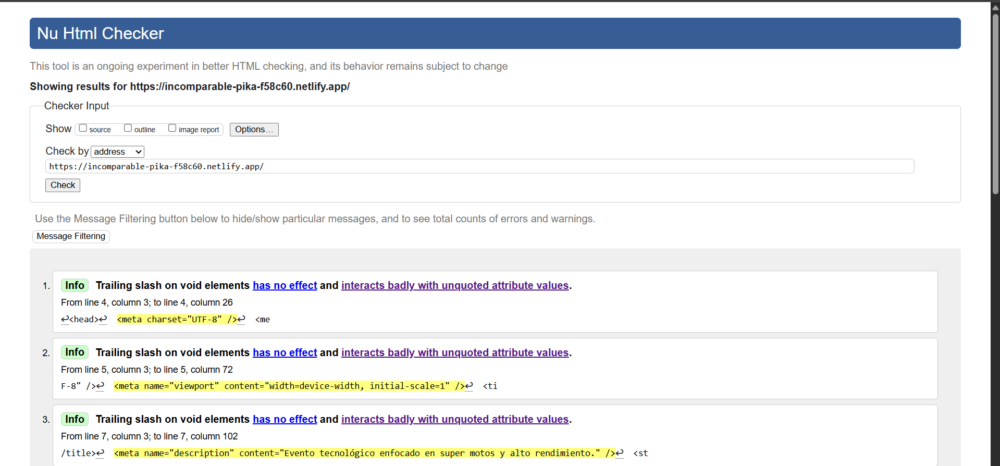
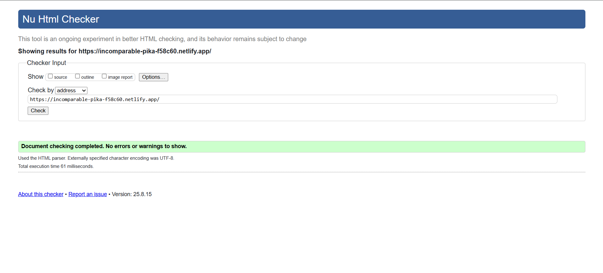
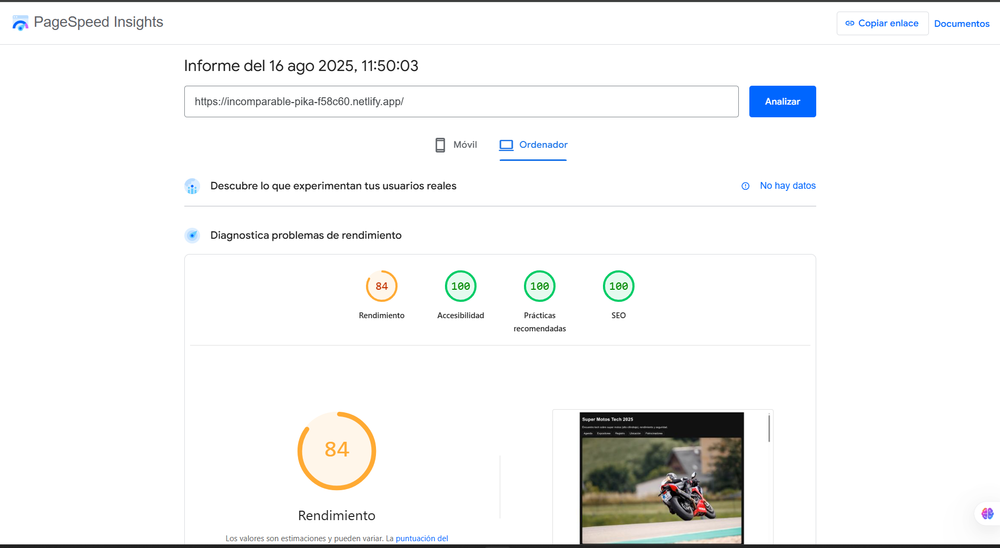

# 🏍️ Super Motos Tech 2025
Sitio web estático sobre el evento tecnológico de alto cilindraje, seguridad y rendimiento.

---

## 1. 🎯 Descripción
Super Motos Tech 2025 — Evento enfocado en super motos y alto rendimiento.  
El sitio incluye agenda, expositores, formulario de registro, ubicación y patrocinadores.

---

## 2. 🧩 Estructura Semántica
- `<header>`: Título del evento, descripción y navegación principal.  
- `<main>`: Contiene las secciones clave del sitio.  
- `<section>`: Divide el contenido en bloques temáticos (agenda, expositores, etc.).  
- `<article>`: Información detallada de cada expositor.  
- `<form>`: Registro de participantes con campos accesibles.  
- `<aside>`: Consejos rápidos relacionados con la ubicación.  
- `<footer>`: Créditos y enlace de retorno al inicio.  

---

## 3. 🌍 URL pública en Netlify
👉 [Sitio WEB](https://incomparable-pika-f58c60.netlify.app/)

---

## 4. ✅ Validación W3C
En general, el resultado que me generó la validación fue mayormente algo informativo, sin errores.

Los warnings informativos que me dio fue para realizar el cambio y no utilizar el "(/)" al final ya que el  "(/)" en elementos vacíos (void elements) como "meta", "br", "img", "input" no tiene ningún efecto en HTML5, y a veces puede dar problemas si además se llega a utilizar atributos sin comillas.
Luego de realizar los cambios que la página recomienda, y volver a realizar el análisis, este es el resultado.

---

## 5. 🌟 Resultados Lighthouse

---

## 6. ♿ Accesibilidad aplicada
En el desarrollo se incluyeron medidas para mejorar la accesibilidad:

- **`tabindex`**:  
  - En la imagen principal (`header > figure > img`) se añadió `tabindex="0"` para permitir que los usuarios de teclado puedan enfocarla y leer su descripción.  
  - En la foto de un expositor se usó `tabindex="-1"` para evitar que sea parte de la navegación, ya que el contenido ya está explicado en el texto.  

- **Atributos `aria-*`**:  
  - `aria-label="Navegación principal"` en la `<nav>` para que lectores de pantalla anuncien correctamente la barra de navegación.  
  - `aria-labelledby="titulo-registro"` en el formulario para que el encabezado del formulario sea leído como referencia del contenido.  
  - `aria-label="Logos de patrocinadores"` en el contenedor de imágenes de patrocinadores, lo que ayuda a dar contexto del grupo.  

- **Textos alternativos (`alt`)**:  
  - Todas las imágenes cuentan con descripciones relevantes, como *“Moto de alta cilindrada tomando una curva en pista”* o *“Mapa ilustrativo de la ubicación del evento en San José”*.  
  - Los logos de patrocinadores incluyen `alt` con el nombre de la marca para no dejar imágenes sin descripción.  

- **Enlaces descriptivos**:  
  - Se usaron enlaces con texto claro y contexto, por ejemplo *“MotosGP, Competencia: Superbike”* en lugar de un simple “clic aquí”.  
  - El enlace de navegación rápida *“Ir al contenido principal”* (`.skip-link`) mejora la experiencia de quienes usan teclado o lector de pantalla.  

- **Otros detalles**:  
  - Se usó `rel="noopener noreferrer"` en enlaces externos para mejorar seguridad y accesibilidad.  
  - Botón de envío del formulario con `aria-label` para que su propósito sea claro en lectores de pantalla.  

---
